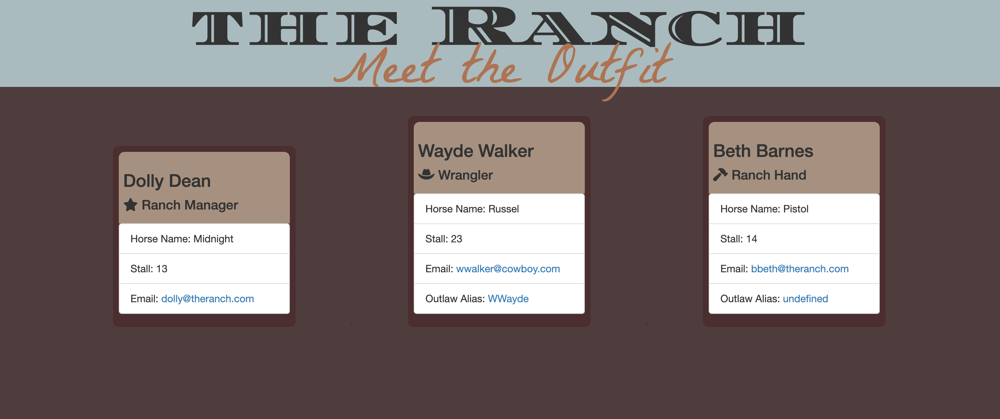

# team-profile-generator

## Description

Keep track of your whole outfit with this easy-to-use employee tracker. Input your Ranch Manager and and any subsequent wranglers or ranch hands and an html page is generate with the specific details of each person, their horse, any aliases they go by and more! 

This may be the Wild West, but your outfit doesn't have to be lawless!

## Table of Contents (Optional)

- [Installation](#installation)
- [Usage](#usage)
- [Credits](#credits)
- [License](#license)

## Installation

This application runs on Node.js and requires inquirer to be installed. Run <npm i installer> in the command line to get inquirer up and running. 

## Usage

Visit the demo video [here](https://drive.google.com/file/d/1C2HF9CQoPODgbf2gNkVPNxXFOgz9LwvN/view).

## Credits

N/A

## License

This work is covered by a MIT license, for more information read about the license [here](https://choosealicense.com/licenses/mit/)

## How to Contribute
If you have any suggestions or questions about the app, I'd love to hear from you! 

Please reach out to me on GitHub at ChelsRunnn. 